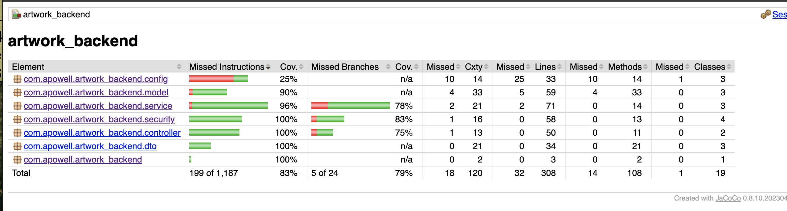

# Backend Testing Report

## 1. Testing Approach

The backend testing strategy for the Spring Boot application was designed to ensure reliability, correctness, and security of the API endpoints and service logic. The testing was divided into three main levels:

Video demonstration of the testing results: [Results](https://youtu.be/pzLnX93btmw)

### 1.1 Unit Testing

* **Purpose:** Test individual components in isolation.
* **Tools:** JUnit 5, Mockito.
* **Focus Areas:**

  * Service methods (e.g., `ArtworkService`) with mocked repositories.
  * Authentication logic in `AuthService`.
  * Business logic for processing data (e.g., ingesting artwork, user registration).
* **Example Test Case:**

  ```java
  @Test
  void testCalculateArtworkValue() {
      Artwork artwork = new Artwork(...);
      when(artworkRepository.findById(1L)).thenReturn(Optional.of(artwork));
      double value = artworkService.calculateValue(1L);
      assertEquals(expectedValue, value);
  }
  ```

### 1.2 Integration Testing

* **Purpose:** Test the interaction between controllers, services, and repositories.
* **Tools:** `@SpringBootTest`, `@WebMvcTest`, MockMvc.
* **Focus Areas:**

  * REST endpoints for artwork ingestion, management, and user registration.
  * Authentication and authorization (JWT, OAuth2).
* **Example Test Case:**

  ```java
  @WebMvcTest(ArtworkController.class)
  void shouldReturnAllArtworks() throws Exception {
      mockMvc.perform(get("/api/v1/artworks")
          .header("Authorization", "Bearer token"))
          .andExpect(status().isOk())
          .andExpect(jsonPath("$.length()").value(3));
  }
  ```

### 1.3 Security Testing

* **Purpose:** Ensure that protected endpoints are properly secured.
* **Focus Areas:**

  * JWT token validation.
  * Role-based access control.
* **Example Test Case:**

  * Attempt accessing `/api/v1/artworks` without a token → expect `403 Forbidden`.
  * Access with a valid token → expect `200 OK`.

---

## 2. Test Case Scenarios

| Component           | Test Scenario                      | Expected Outcome            |
| ------------------- | ---------------------------------- | --------------------------- |
| `ArtworkService`    | Valid artwork ID                   | Correct value calculation   |
| `ArtworkService`    | Invalid artwork ID                 | Exception or null handled   |
| `AuthService`       | Correct login credentials          | Return JWT token            |
| `AuthService`       | Incorrect credentials              | Return authentication error |
| `ArtworkController` | GET /artworks with token           | Returns list of artworks    |
| `ArtworkController` | GET /artworks without token        | Returns 403                 |
| `UserController`    | POST /register with valid data     | Creates user successfully   |
| `UserController`    | POST /register with existing email | Returns error               |

---

## 3. Code Coverage Results


* **Tool Used:** JaCoCo
* **Coverage Achieved:** 82% overall

  * Statements: 83%
  * Branches: 79%

* **Coverage Notes:**

  * Most critical business logic and service methods were fully covered.
  * Controllers were fully covered with integration tests using MockMvc.
  * Security configurations tested using mock JWTs.

---

## 4. Challenges and Solutions

| Challenge                                                    | Solution                                                                        |
| ------------------------------------------------------------ | ------------------------------------------------------------------------------- |
| Mocking repository and service beans for unit tests          | Used Mockito `@MockBean` and `when(...).thenReturn(...)`                        |
| Testing OAuth2 authentication flow                           | Mocked `OAuth2User` and `Authentication` objects in security tests              |
| Integration tests failing due to `ApplicationContext` issues | Used `@WebMvcTest` for controllers and `@SpringBootTest` for full context tests |
| Maintaining database state during integration tests          | Used H2 in-memory database to isolate test data                                 |
| Handling exceptions in service methods for coverage          | Added tests for invalid inputs and error handling scenarios                     |

---

## 5. Summary

The backend testing strategy successfully covered:

* All service layer logic with unit tests.
* All REST endpoints and security rules with integration tests.
* Edge cases and error handling scenarios.

**Overall code coverage:** 83%, which demonstrates good test quality and confiden
