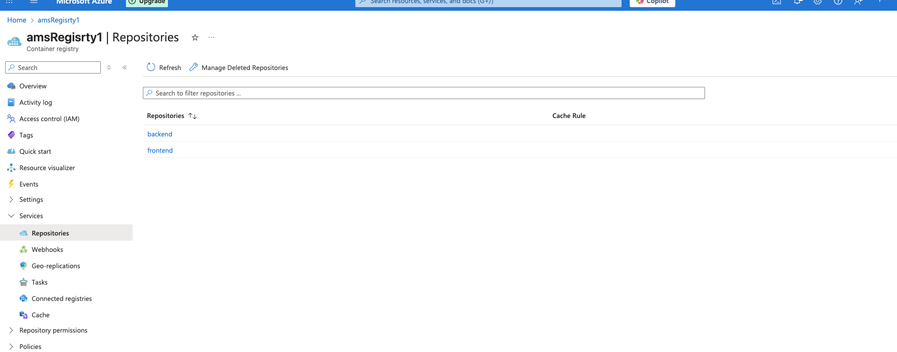
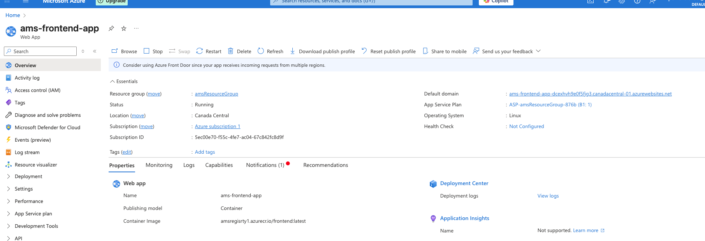
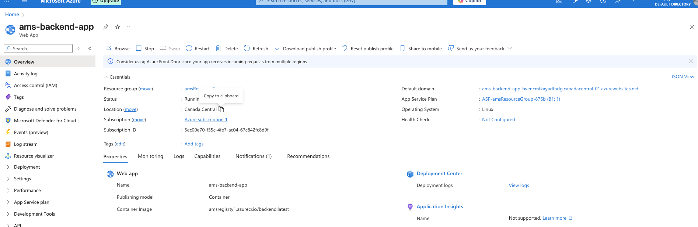
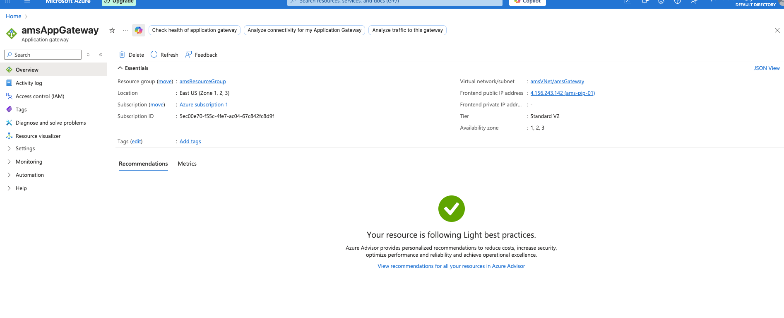
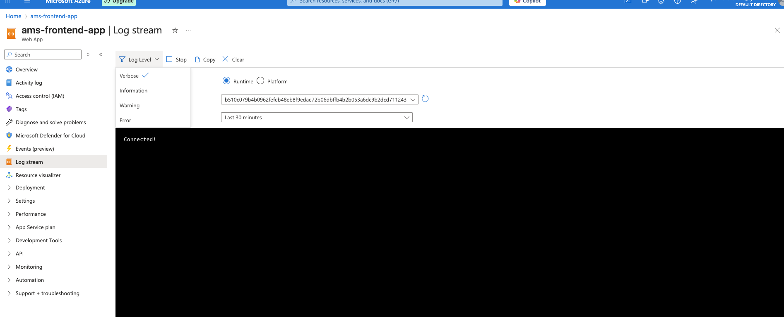
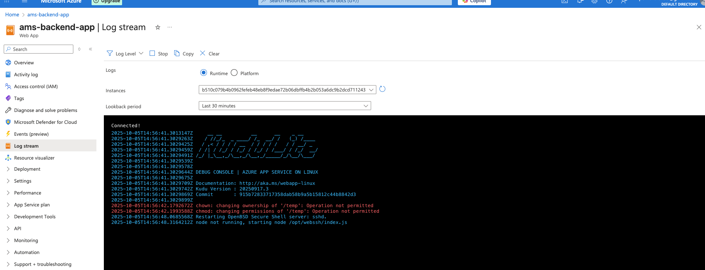
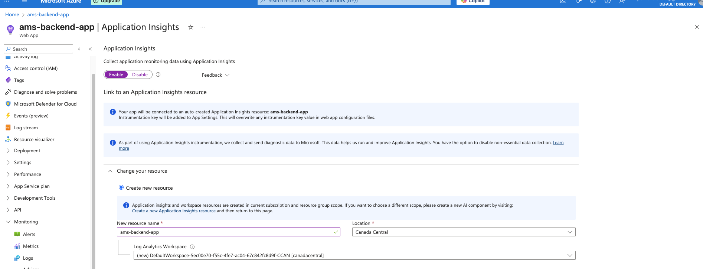
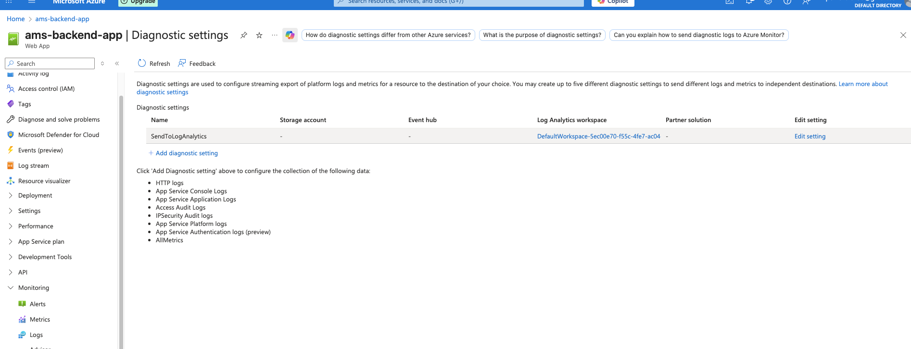

# Deployment Process, Security, Scalability, and Monitoring of My Application

## Introduction
The purpose of this report is to document the deployment process and operational design of my application, which consists of a **frontend (React)** and a **backend (Spring Boot)**. Both components are containerized and deployed separately to **Azure App Services** through the **Azure Container Registry (ACR)**. The project leverages **GitHub Actions** for continuous integration and deployment (CI/CD), **Azure Active Directory (IAM)** for secure authentication of the pipeline, and Azure’s built-in features for scalability, monitoring, and logging.  

---

## 1. Deployment Process with GitHub Actions
The application follows a **CI/CD workflow** using **GitHub Actions**. The process is triggered whenever changes are pushed to the main branch. The workflow performs the following steps:  

1. **Checkout Source Code**  
   - The repository is pulled into the GitHub Actions runner.  

2. **Build Frontend and Backend Docker Images**  
   - The workflow uses `docker build` commands to build images for both the frontend and backend.  
   - Example for frontend:  
     ```bash
     docker build -t amsregistry1.azurecr.io/frontend:latest ./frontend
     ```  
     Here `./frontend` is the directory containing the frontend `Dockerfile`.  

3. **Push Images to Azure Container Registry (ACR)**  
   - After building, both images are tagged and pushed to **amsregistry1.azurecr.io**, which is my Azure Container Registry.  

4. **Deploy to Azure App Services**  
   - The workflow then triggers deployment to two separate App Services (one for frontend and one for backend).  
   - Each App Service is configured to pull the latest container image from ACR.  

5. **Testing**  
   - The pipeline is capable of running automated tests. For example, the backend (Spring Boot) can run Maven test commands before deployment, ensuring code reliability and Vitest + Jest for the frontend.  

This automated workflow eliminates manual intervention and ensures that every change to the codebase can be quickly and reliably deployed to production.  

---

## 2. Security Through Azure IAM
Security for the deployment process is provided through **Azure Identity and Access Management (IAM)**, specifically **Azure Active Directory (AAD)**.  

- **Service Principal Authentication**  
  - A **Service Principal** was created in Azure AD using the `az ad sp create-for-rbac` command.  
  - This generates a JSON file containing credentials (client ID, client secret, tenant ID, and subscription information).  
  - This JSON file was stored as a GitHub Secret (`AZURE_CREDENTIALS`).  

- **Azure Login in Workflow**  
  - The deployment workflow uses the following step:  
    ```yaml
    - name: Azure Login
      uses: azure/login@v1
      with:
        creds: ${{ secrets.AZURE_CREDENTIALS }}
    ```  
  - This securely logs the workflow into Azure without exposing any raw credentials in the codebase.  

- **Role-Based Access Control (RBAC)**  
  - The Service Principal was granted the **Contributor** or **AcrPush** role on the Azure Container Registry and App Services.  
  - This enforces the principle of least privilege, allowing the GitHub Actions workflow to only perform necessary tasks (push images and trigger deployments).  

This IAM approach ensures that the CI/CD pipeline is secured using **cloud-managed credentials** rather than storing plain usernames and passwords, aligning with best practices in cloud security.  

---

## 3. Scalability with Azure
Scalability is a critical feature for modern cloud applications. My application benefits from Azure’s automatic scaling features in the following ways:  

1. **Azure Container Registry (ACR)**  
   - Provides a centralized, scalable repository for storing container images.  
   - Supports versioning and image replication, which ensures that deployments remain consistent across environments.  



2. **Azure App Services**  
   - App Services automatically handle load balancing, health monitoring, and container scaling.  
   - Horizontal scaling (scaling out) can be configured to automatically add more instances of the service if demand increases.  
   - Vertical scaling (scaling up) can increase CPU, memory, and network resources if needed.  




This means my application can handle increased traffic and workload without requiring major architectural changes. Azure’s scaling is managed at the infrastructure level, reducing the operational burden on developers.  

3. **Azure Application Gateway**
    - In conjunction with the backend service, there is a middle man to help with load balancing via an
    Azure Application Gateway
    - This gateway is used to connect the frontend to the backend in a way that will help with more security and distribution of load



---

## 4. Monitoring and Logging
Monitoring and logging are essential for maintaining application health, diagnosing issues, and ensuring uptime. Azure provides built-in capabilities that were enabled for my deployment:  

1. **Application Logs**  
   - App Services automatically collect container logs (stdout and stderr).  
   - These logs are accessible through the Azure Portal or via `az webapp log tail`.  

2. **Metrics and Monitoring**  
   - Azure provides performance metrics such as CPU usage, memory usage, and response times.  
   - Alerts can be configured to notify if thresholds are exceeded.  




By leveraging these Azure features, the system gains observability without requiring additional third-party monitoring tools.  

---

## Conclusion
The deployment of my application uses a **modern, cloud-native approach** with GitHub Actions, Azure Container Registry, and Azure App Services.  

- The **deployment process** is fully automated through CI/CD pipelines.  
- **Security** is enforced by Azure AD Service Principal credentials stored as GitHub Secrets.  
- **Scalability** is achieved by relying on Azure’s built-in auto-scaling for App Services and container management.  
- **Monitoring and logging** are provided natively through App Services, ensuring operational visibility.  

This design ensures that the application is **secure, resilient, and scalable**, aligning with best practices for cloud deployments.  

---

## 5. Bonus: Using Azure AI for Monitoring and Logging

As a bonus enhancement to the deployment, I integrated Azure AI-powered monitoring and logging to extend observability and proactive detection of issues. This aligns with how services like AWS CodeGuru or Google Cloud AI Platform bring intelligence into DevOps workflows.

### Azure Monitor and Application Insights
Azure Application Insights was enabled on the deployed App Service. This service uses built-in anomaly detection powered by machine learning to automatically identify unusual patterns in telemetry data. For example, if API response times deviate significantly from normal baselines, the system can trigger alerts without requiring manual thresholds.



### AI-Driven Log Analysis
Logs from the containers and application services are ingested into Azure Log Analytics. By using Kusto Query Language (KQL) combined with AI assistance, the system can automatically suggest log queries and highlight root causes of failures. For example, it can detect that the majority of errors in a timeframe were related to a specific dependency or misconfiguration.




**Outcome:** With these AI integrations, the deployment is not only automated, secure, and scalable, but also proactively monitored using Azures GenAI. This ensures that anomalies are detected early, root causes are automatically identified, and developers receive intelligent insights into both performance and reliability.
